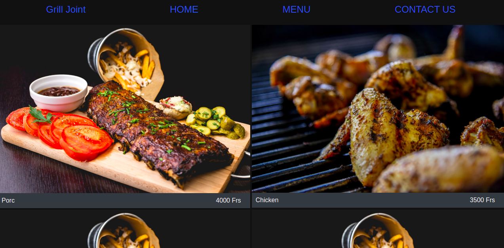

# Grill Joint

A  project for Javascript Module

This project is a completely static restaurant page where one can:

- Switch between different tabs( Home, Menu, and Contact Us)
- Each tab displays a different information about the restaurant

## Grill Joint screenshot

## Built With

- JavaScript
- HTML
- CSS3
- webpack
- Bootstrap

## Getting Started

To get a local copy up and running follow these simple example steps.

- Clone this project by typing `https://github.com/wandji20/Grill-Joint`
- cd into Grill-Joint
- Run git pull origin main

If you want to repack the file

- Run npm install on the terminal to install dependancies
- Run npm run build to pack the files in the src folder
- Go to the dist folder and open index.html
- Run npm run start to open it on a live server

Else

- Just Go to the dist folder and open index.html

## Author

👤 **Wandji Bertrand**

- Github: [@wandji20](https://github.com/wandji20)
- Twitter: [@wandjibertrand](https://twitter.com/wandjibertrand)
- Linkedin: [Linkedin](https://www.linkedin.com/in/wandji-bertrand/)

## Acknowledgements

- Microverse
- The Odin Project

## 🤝 Contributing

Contributions, issues, and feature requests are welcome!

## Show your support

Give a ⭐️ if you like this project!

## 📝 License

Copyright 2020 Wandji Bertrand

Permission is hereby granted, free of charge, to any person obtaining a copy of this software and associated documentation files (the "Software"), to deal in the Software without restriction, including without limitation the rights to use, copy, modify, merge, publish, distribute, sublicense, and/or sell copies of the Software, and to permit persons to whom the Software is furnished to do so, subject to the following conditions:

The above copyright notice and this permission notice shall be included in all copies or substantial portions of the Software.

THE SOFTWARE IS PROVIDED "AS IS", WITHOUT WARRANTY OF ANY KIND, EXPRESS OR IMPLIED, INCLUDING BUT NOT LIMITED TO THE WARRANTIES OF MERCHANTABILITY, FITNESS FOR A PARTICULAR PURPOSE AND NONINFRINGEMENT. IN NO EVENT SHALL THE AUTHORS OR COPYRIGHT HOLDERS BE LIABLE FOR ANY CLAIM, DAMAGES OR OTHER LIABILITY, WHETHER IN AN ACTION OF CONTRACT, TORT OR OTHERWISE, ARISING FROM, OUT OF OR IN CONNECTION WITH THE SOFTWARE OR THE USE OR OTHER DEALINGS IN THE SOFTWARE.
